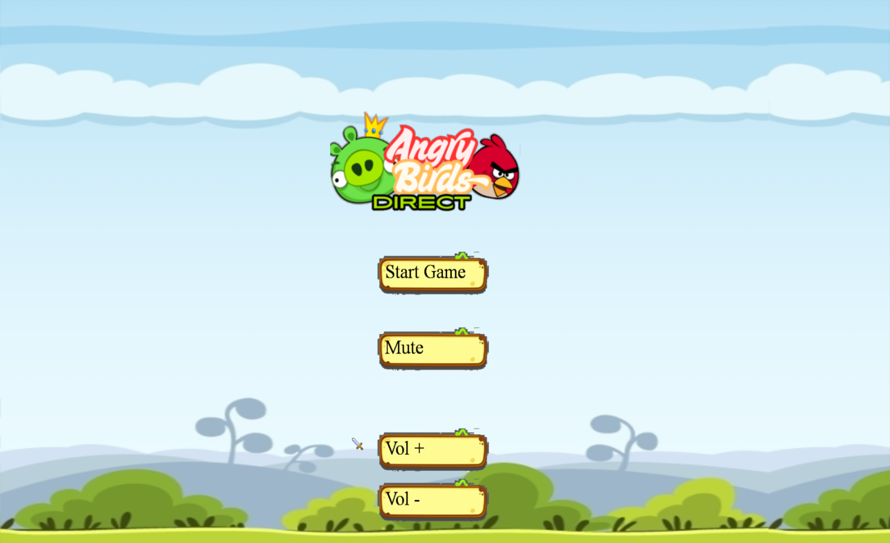
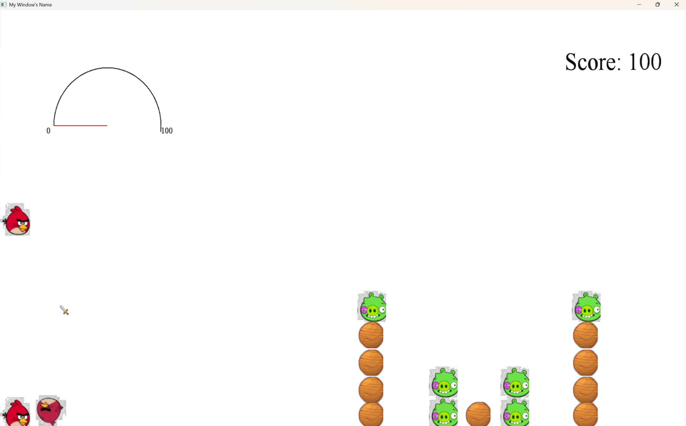
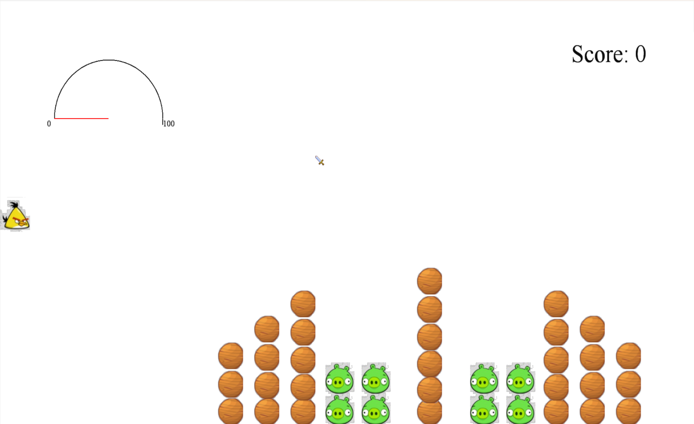
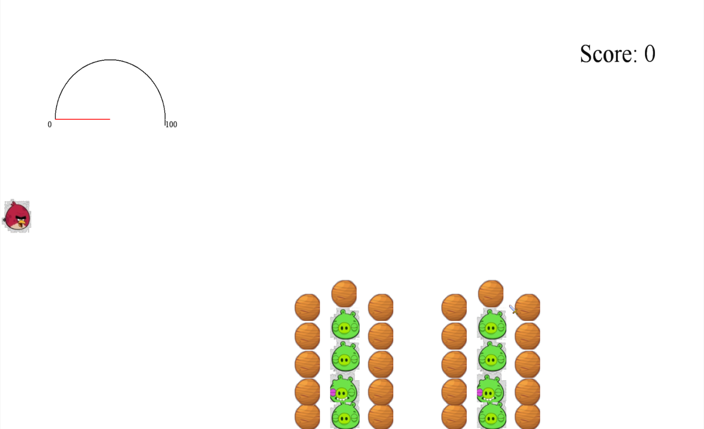
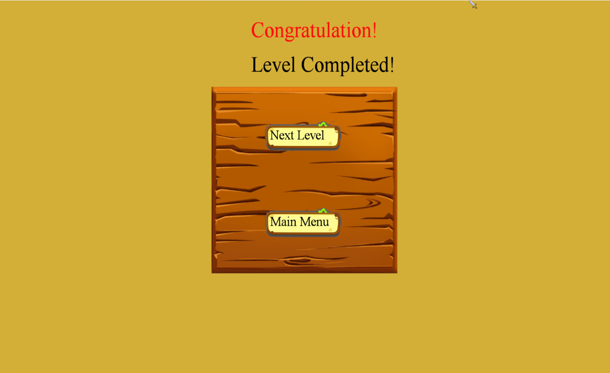
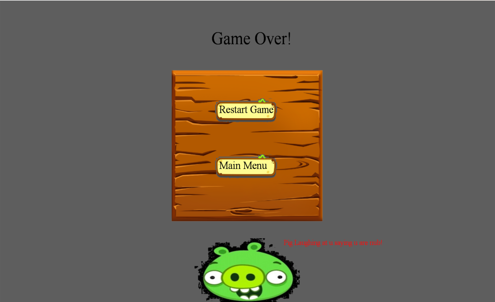

# 2D Game Framework — Projectile Puzzle Game

A C++ 2D projectile puzzle game built for the **Computer Game Programming** assignment. The game uses a modular framework with scene management, sprite rendering, realtime input, audio, and custom 2D physics.

Players launch birds at pig targets across three levels, balancing launch power, trajectory, collision damage, and each bird’s abilities.

## Highlights

- Designed and implemented a reusable 2D game framework in C++.
- Built projectile gameplay with charge-based force and gravity.
- Implemented collision detection, bounce response, friction, and impact-based damage.
- Created three playable puzzle levels with distinct bird availability and win/lose conditions.
- Integrated menu navigation, UI buttons, score tracking, level progression, and game states.
- Added music, sound effects, mute control, and adjustable volume with FMOD.

## Technical Implementation

### Architecture

The project separates gameplay systems into focused classes:

```text
Game
├── Window ------------ Win32 window creation and message handling
├── DirectX ----------- Direct3D 9 device setup and rendering lifecycle
├── DirectInput ------- Keyboard and mouse input polling
├── Audio ------------- FMOD sound loading, playback, and volume control
├── GameStack --------- Scene navigation and lifecycle management
└── GameScene --------- Shared scene interface
    ├── MainMenu
    ├── Level1
    ├── Level2
    ├── Level3
    ├── GameOver
    └── LevelCompleted
```

Core gameplay objects build on a shared `GameObject` class:

- `Bird` manages launch state and special boost behaviour.
- `Pig` tracks health, damage, and destruction state.
- `PhysicsManager` handles position, velocity, acceleration, gravity, collisions, restitution, and friction.
- `Sprite`, `Texture`, `Font`, `Line`, and `Button` provide reusable rendering and UI functionality.

### Physics and Gameplay

The projectile system uses a charge-and-release mechanic. Holding `Space` increases launch power until it reaches a configured maximum; releasing it applies an initial force to the active bird.

The physics manager handles:

- Gravity-based motion
- Velocity and acceleration updates
- Wall collision handling
- Object-to-object collision checks
- Restitution for bounce response
- Friction to reduce movement after impact
- Collision damage scaled by impact

### Rendering and Input

- **Direct3D 9 / D3DX** renders textured sprites, text, and lines.
- **Spritesheet animation** is used for moving game objects.
- **DirectInput** polls keyboard and mouse state each frame for responsive gameplay.
- The game loop follows a standard `input -> update -> render` structure.
- A frame timer controls update frequency and keeps animation and physics consistent.

### Audio

FMOD is used to manage:

- Background music
- Launch and collision sound effects
- Menu feedback
- Win and gameover sounds
- Runtime mute and volume controls

## Controls

| Input | Action |
| --- | --- |
| Hold `Space` | Charge launch power |
| Release `Space` | Launch current bird |
| `Space` after launch | Activate yellow bird boost |
| `Left` / `Right` | Select an available bird |
| Mouse | Interact with menu buttons |
| `N` | Advance to the next level during testing |

## Technology Stack

- C++
- Object-oriented programming
- Win32 API
- DirectX 9 / D3DX
- DirectInput
- FMOD Studio API
- Visual Studio 2022
- Windows SDK 10

## Building the Project

### Requirements

- Windows 10 or later
- Visual Studio 2022 with **Desktop development with C++**
- Windows 10 SDK
- DirectX 9 libraries, including legacy D3DX support
- FMOD Studio API for Windows

### Steps

1. Open `CGP prac.sln` in Visual Studio.
2. Select `Debug | Win32` or another 32-bit configuration.
3. Ensure FMOD library paths are configured in the Visual Studio project settings.
4. Build and run the solution.
5. Run with `CGP prac` as the working directory so the executable can locate `assets`.

## Technical Highlights

- Implemented a modular C++ game framework using scene-based architecture for the main menu, levels, game-over screen, and level-completion screen.
- Built a custom 2D physics system that manages gravity, velocity, acceleration, friction, restitution, wall boundaries, and object-to-object collisions.
- Implemented charge-based projectile launching, where holding and releasing `Space` applies variable force to the active bird.
- Collision damage is calculated from impacts, allowing birds to damage and destroy pigs with different health values.
- Used object oriented design with reusable `GameObject`, `Bird`, `Pig`, `Sprite`, `Texture`, `Button`, and `PhysicsManager` classes.
- Implemented spritesheet animation for moving characters and visual game objects.
- Rendered sprites, text, UI elements, and lines with Direct3D 9 and D3DX.
- Used DirectInput for realtime keyboard and mouse polling.
- Created a stack-based scene manager to transition between menus, levels, win states, and loss states.
- Integrated FMOD for background music, launch effects, collision sounds, menu feedback, muting, and volume control.
- Added bird specific gameplay behaviour, including a midflight boost for the yellow bird.

## Screenshots

### Main Menu


### Gameplay


### Level 1


### Level 2


### Level 3


### Level Completed


### Game Over

